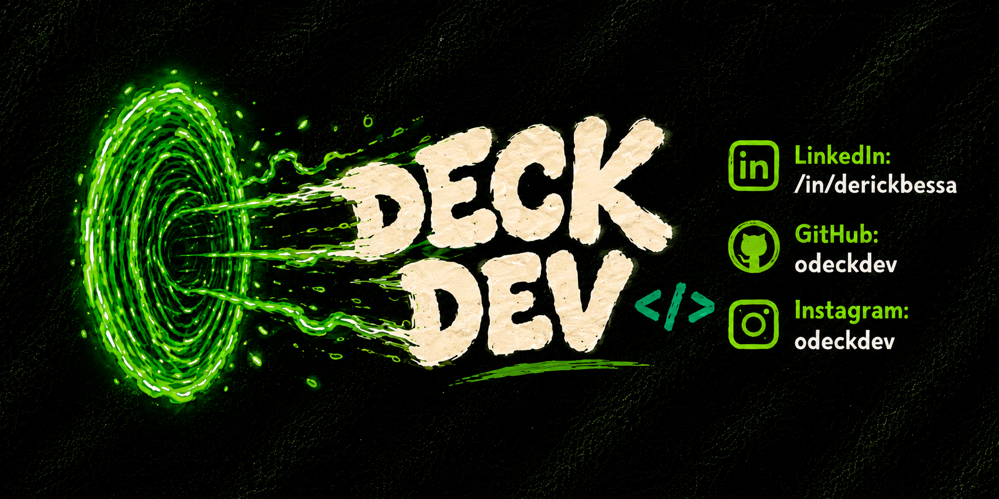

 

<a href="https://derickbessa.github.io/">Portfolio</a> • <a href="https://linkedin.com/in/derickbessa">LinkedIn</a> • <a href="https://cv-resumes.vercel.app/english/resume.html">Resume</a> • <a href="https://instagram.com/odeckdev">Deck Dev</a>

---

## Hey, I'm Derick 👋

**Full-Stack Developer** and Computer Science student at **IFCE**.

Currently working at **Agilean** with `React`, `Node.js` and `.NET`, while building projects focused on **backend, AI, automation and real-world products**.

---

# 🚀 Projects

### 🛰️ Sentinela

**Real-time platform health monitoring system**

`Python` `WebSocket` `Loki` `SQL Server` `Grafana`

Real-time production monitoring with anomaly detection, automatic reconnection, historical backfill and Microsoft Teams alerts.

**211 automated tests** covering the monitoring pipeline.

---

### 💍 Até o Altar

**Mobile wedding planning platform**

`React Native` `Expo` `TypeScript` `Supabase` `AI`

Mobile product with authentication, RLS, storage, Edge Functions, automated reminders and isolated generative AI integration.

---

### 🛒 AgileShop

**Full-stack product platform**

`React 19` `.NET 10` `EF Core` `SQLite`

Complete REST API with filtering, pagination, shopping cart, dashboard and dark mode.

Built in **4 days** with approximately **70% automated test coverage**.

---

## 💼 Experience

**Agilean** — Software Development Intern
`React` `Node.js` `.NET` `SQL Server`

**LabVicia · IFCE** — Full-Stack Developer / Research Scholar
`Angular` `Java` `Spring Boot` `PostgreSQL`

**LAPISCO · IFCE** — Research Scholar
`Python` `FastAPI` `Java` `Computer Vision`

---

## 📊 GitHub Statistics

 

---

### `build → ship → improve`

